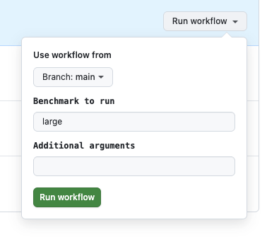

# SIR Bench

This crate compares implementations of a basic stochastic continuous-time SIR transmission model
with the same parameters.

## Methodology

We use `hyperfine` for benchmarking, which is a platform-agnostic benchmarking
tool. The baseline implementation is a simple stochastic SIR model using minimal
dependencies.

So far, I've only run these on my local machine.

## Running the tests

Install [`just`](https://just.systems/man/en/packages.html) to use the the commands
in `justfile`; you can also install hyperfine (`cargo install hyperfine`), build
the binaries, and run each test yourself. take a look at `justfile` for how to
run hyperfine directly.

```sh
# Installs hyperfine
just setup

# Run the sir benchmark, which has a population of 1000
just compare sir

# Run the large benchmark only up to t=50
just compare large -t 50

```

## Model implementations

* `baseline`: A statically typed, simple implementation that stores the population
  in a `Vec<Person>`, and uses simple random sampling to select contacts.
* `ixa`: An implementation that uses ixa, using `sample_person` / querying; the model adds an index on `InfectionStatus`.
* `ixa-no-queries`: Same as `ixa` but avoids indexing or querying the population. The intention here is to isolate the effect of indexing/querying.

## Benchmarks

## sir

Small population with the following parameters:

```
r0: 1.5,
infectious_period: 3.0,
population: 1000,
initial_infections: 5,
seed: 1235,
max_time: args.time,
enable_stats: args.stats,
```

## large

Same parameters as the small test, but with a population of 100k.

## Results

The following results are from a CI run on  commit `365d7f3`. You can reproduce these results by running the [benchmarks](https://github.com/k88hudson-cfa/sir-bench/actions/workflows/benchmarks.yml) workflow with `large` as the first input:



Or running `just compare large` locally.

Overall, it appears that the baseline implementation of a basic SIR model for a population of 100k with
a final attack rate of ~58%) is around 7x faster than the ixa implementation, and
that using indexed queries for contact selection increases
the runtime by around `40x`:

```
Benchmark 1: ./target/release/large --model baseline
  Time (mean ± σ):      25.7 ms ±   0.3 ms    [User: 21.5 ms, System: 4.3 ms]
  Range (min … max):    25.6 ms …  26.0 ms    3 runs

Benchmark 2: ./target/release/large --model ixa
  Time (mean ± σ):      7.470 s ±  0.233 s    [User: 7.453 s, System: 0.016 s]
  Range (min … max):    7.279 s …  7.730 s    3 runs

Benchmark 3: ./target/release/large --model ixa-no-queries
  Time (mean ± σ):     182.0 ms ±   0.7 ms    [User: 178.5 ms, System: 3.4 ms]
  Range (min … max):   181.3 ms … 182.7 ms    3 runs

Summary
  ./target/release/large --model baseline  ran
    7.07 ± 0.08 times faster than ./target/release/large --model ixa-no-queries
  290.19 ± 9.55 times faster than ./target/release/large --model ixa
```

These results are not obivous
